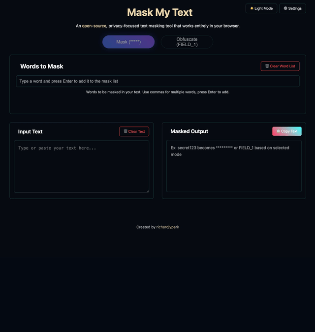

# Mask My Text

[](https://github.com/richardjypark/maskmytext.com/actions/workflows/deploy.yml)

A privacy-focused text masking tool that works entirely in your browser. Uses WebAssembly and Rust.



## Development Setup

1. **Clone the repository:**

   ```bash
   git clone https://github.com/richardjypark/maskmytext.com.git
   cd maskmytext.com
   ```

2. **Install dependencies:**

   ```bash
   wasm-pack build
   ```

   ```bash
   cd www
   pnpm install
   ```

3. **Run the project:**

   ```bash
   pnpm run dev
   ```

## Testing

To run tests, use the following command:

```bash
wasm-pack test --headless --chrome
```

```bash
cd www
pnpm test
```

## Deployment

The application is automatically built, tested, and deployed to **GitHub Pages** whenever the `master` branch is updated. The workflow responsible for this lives at `.github/workflows/deploy.yml`.

### Quick deploy

1. Make sure all tests pass locally (`wasm-pack test --headless --chrome` and `pnpm test` inside `www`).
2. Commit your changes and push (or merge a pull-request) to `master`.
3. Watch the **Actions → Build, Test, and Deploy** workflow – it will:
   - Check out the repository and restore caches
   - Build the Rust → WebAssembly package (`wasm-pack build --release`)
   - Run Rust and Playwright tests
   - Build the production bundle (`pnpm build:prod`)
   - Publish the `www/dist` folder to GitHub Pages
4. When the workflow finishes successfully your changes will be live at **https://maskmytext.com** (or the GitHub Pages URL for forks).

### Manual redeploy

Need to redeploy without new commits? Open **Actions → Build, Test, and Deploy → Run workflow** to trigger the pipeline manually (enabled by the `workflow_dispatch` event).

## License

MIT
