```mermaid
graph TD
    subgraph "Client Browser"
        UI[User Interface]
        HTML[index.html]
        CSS[CSS Styles]
        JS[JavaScript Logic]
        WASM[WebAssembly Module]
        SW[Service Worker]

        subgraph "Cache Storage"
            LS[Local Storage]
            SC[Service Worker Cache]
            MC[Memory Cache]
            BC[Browser Cache]
        end
    end

    %% Core data flow
    UI -->|User Input| JS
    JS -->|Update UI| UI
    JS -->|Process Text| WASM
    WASM -->|Return Masked Text| JS

    %% Asset loading
    HTML -->|Loads| CSS
    HTML -->|Loads| JS
    JS -->|Imports| WASM

    %% Caching relationships
    JS <-->|"Store/Retrieve (theme, maskMode, maskWords)"| LS
    SW <-->|"Cache Assets (HTML, JS, WASM, icons)"| SC
    JS <-->|"Runtime State (maskWords Set, UI states)"| MC
    BC <-->|"Compiled WASM Module"| WASM

    %% WASM module details
    subgraph "WASM Module Functions"
        MaskText[mask_text<br>Asterisks Mode]
        MaskFieldText[mask_text_with_fields<br>Field Numbers Mode]
        DecodeText[decode_obfuscated_text<br>Field Decoding]
    end

    %% Function flow
    MaskMode{maskMode}
    MaskMode -->|"asterisks"| MaskText
    MaskMode -->|"field_numbers"| MaskFieldText
    JS -->|"Check mode"| MaskMode

    %% Data flow by mode
    subgraph "Asterisks Mode Flow"
        AInput[User Input]
        AMaskWords[Mask Words]
        AProcess[Replace with *****]
        AOutput[Masked Output]
    end

    subgraph "Field Numbers Mode Flow"
        FInput[User Input]
        FMaskWords[Mask Words]
        FProcess[Replace with FIELD_N]
        FOutput[Obfuscated Output]
        FDecode[Decode FIELD_N]
        FDecoded[Decoded Output]
    end

    AInput -->|Text| AProcess
    AMaskWords -->|Word List| AProcess
    AProcess -->|Masked Text| AOutput

    FInput -->|Text| FProcess
    FMaskWords -->|Word List sorted by length| FProcess
    FProcess -->|Obfuscated Text| FOutput
    FOutput -->|Obfuscated Text| FDecode
    FMaskWords -->|Word List| FDecode
    FDecode -->|Original Text| FDecoded

    %% Service Worker Details
    subgraph "Service Worker Functions"
        SWInstall[Install: Cache Assets]
        SWActivate[Activate: Clean Old Caches]
        SWFetch[Fetch: Serve from Cache/Network]
        SWMessage[Handle Messages]
    end

    SWInstall -->|"Create Cache"| SC
    SWActivate -->|"Delete Old Versions"| SC
    SC -->|"Return Cached Assets"| SWFetch
    SWFetch -->|"Cache New Assets"| SC
    SWMessage -->|"skipWaiting Message"| SW
    SW -->|"CACHE_UPDATED Message"| JS

    %% Project structure relationships
    subgraph "Project Root"
        HTMLF[index.html<br>UI + CSS + Main JS]
        JSF[index.js<br>WASM Bridge]
        SWF[service-worker.js<br>Offline Support]
        WASMF[src/lib.rs<br>Rust Text Processor]
        BSJS[bootstrap.js<br>WASM Loader]
    end

    HTMLF -->|References| JSF
    HTMLF -->|References| BSJS
    BSJS -->|Imports| JSF
    JSF -->|Calls| WASMF
    HTMLF -->|Registers| SWF

    %% Data persistence
    subgraph "LocalStorage Items"
        Theme["theme: 'dark'|'light'"]
        MaskM["maskMode: 'asterisks'|'field_numbers'"]
        Words["maskWords: JSON array"]
    end

    Theme -.->|Stored in| LS
    MaskM -.->|Stored in| LS
    Words -.->|Stored in| LS
```

# Mask My Text - Architecture Overview

This diagram illustrates the architecture and data flow of the Mask My Text application. The app is a privacy-focused text masking tool that works entirely in the browser, allowing users to mask or obfuscate sensitive information.

## Key Components

1. **Client-Side Architecture**

   - **index.html**: Main entry point containing UI, CSS, and core JavaScript
   - **index.js**: Bridge to WebAssembly providing masking functions
   - **WebAssembly Module**: Text processing engine written in Rust
   - **Service Worker**: Enables offline functionality and handles updates

2. **WASM Core Functions**

   - **mask_text**: Replaces sensitive words with asterisks (**\***)
   - **mask_text_with_fields**: Replaces words with FIELD_N placeholders
   - **decode_obfuscated_text**: Converts FIELD_N back to original words
   - Processes words by length (longer words first)
   - Preserves case information (lowercase, First letter, ALL CAPS)

3. **Caching Mechanisms**

   - **Local Storage**:
     - theme: 'dark'|'light' theme preference
     - maskMode: 'asterisks'|'field_numbers' masking method
     - maskWords: JSON array of words to mask
   - **Service Worker Cache**:
     - Caches application shell for offline use
     - Multiple cache versions (v4 in service-worker.js)
     - Path-aware caching for different environments
   - **Memory Cache**: Runtime state (Set of maskWords, UI states)
   - **Browser Cache**: Compiled WebAssembly module

4. **Data Flow**

   - User inputs text and manages word list
   - JavaScript checks maskMode and calls appropriate WASM function
   - WASM processes text using regex-based word replacement
   - Asterisks mode: Words replaced with **\***
   - Field numbers mode: Words replaced with FIELD_N
   - Decode functionality available for field numbers mode

5. **Service Worker Lifecycle**

   - Install: Caches application assets
   - Activate: Cleans up old caches, notifies clients
   - Fetch: Serves content from cache or network
   - Message handling: Updates application when new version detected

6. **Project Structure**
   - **index.html**: Contains UI, styles, and most JavaScript
   - **index.js**: WebAssembly bridge
   - **bootstrap.js**: WASM loader
   - **service-worker.js**: Offline support
   - **src/lib.rs**: Rust implementation of text processing
